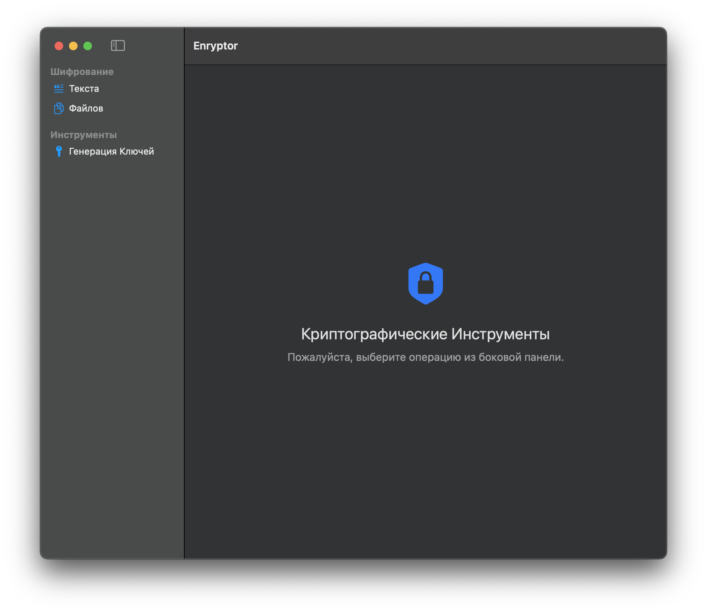
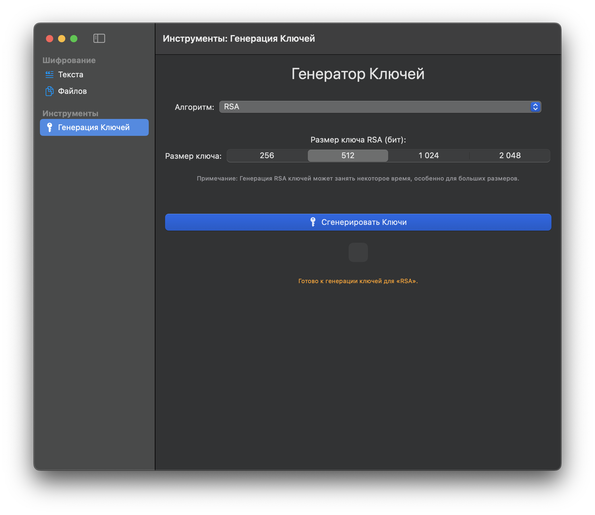
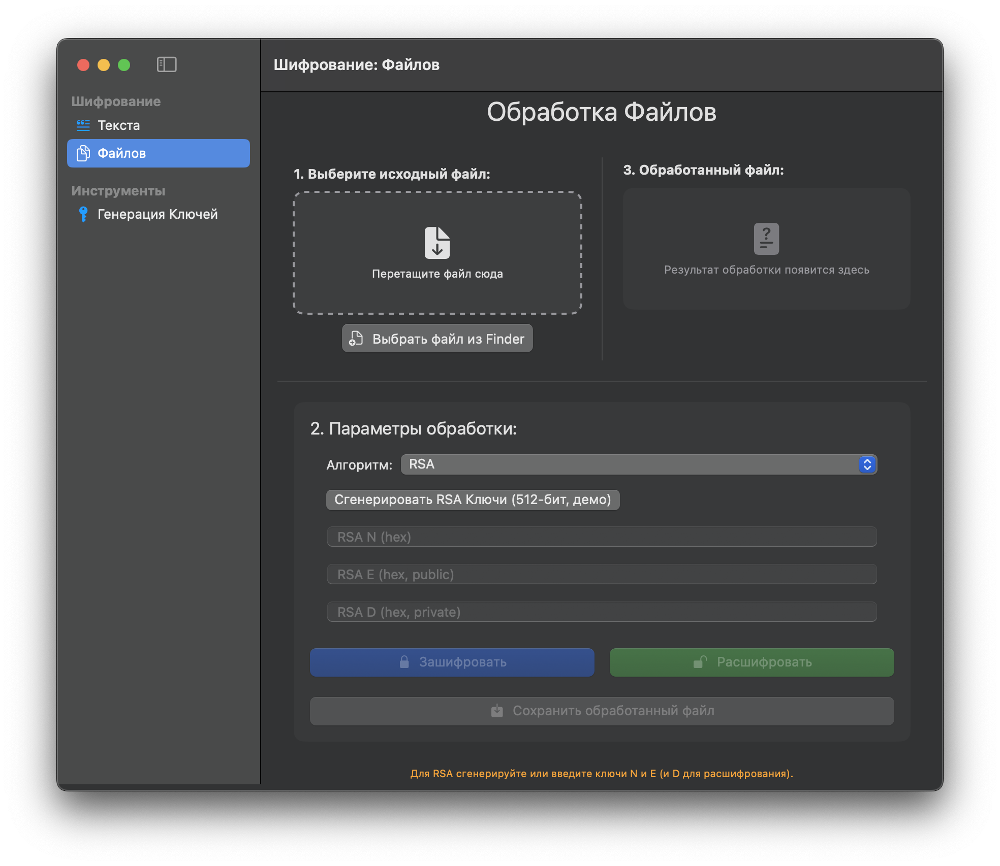
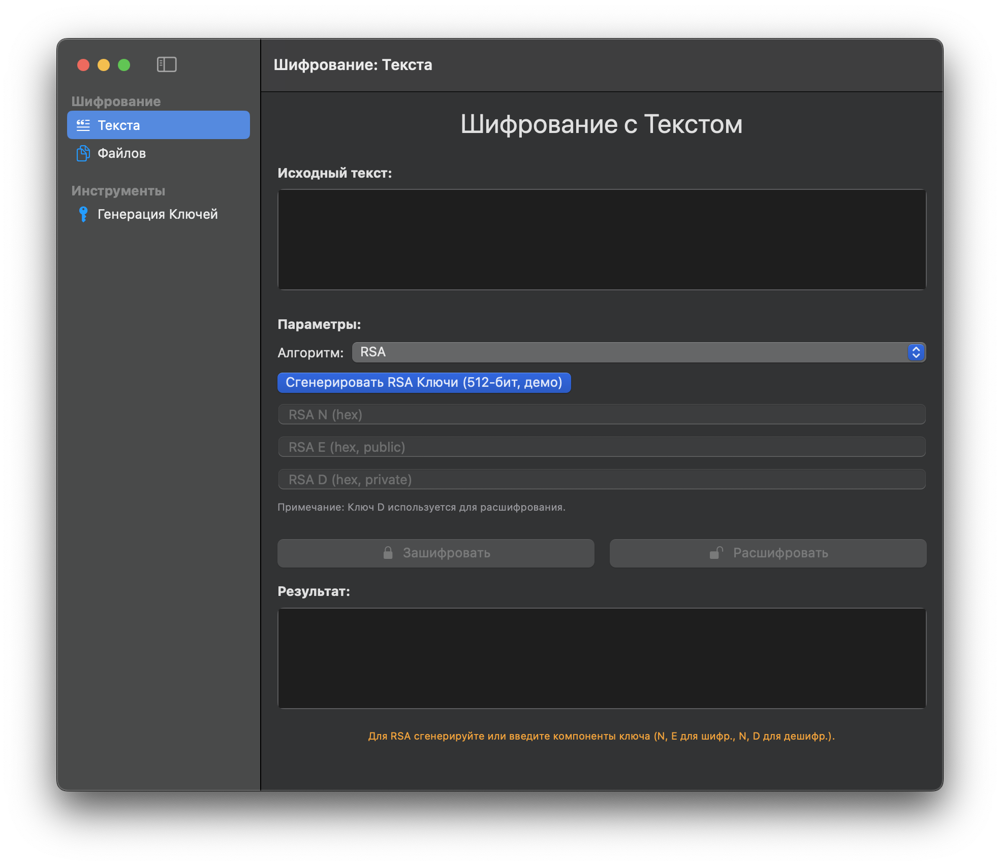

# Расчетно-графическое работа (РГР) по Программированию
_Проект первого курса_

Простое macOS-приложение, демонстрирующее работу нескольких алгоритмов шифрования для текста и файлов.


## 📜 Описание

Это приложение было разработано в рамках расчетно-графической работы (РГР) для демонстрации базовых принципов шифрования. Оно включает реализацию и графический интерфейс для следующих криптографических алгоритмов:

* **RSA**: Асимметричный алгоритм шифрования.
* **ГОСТ 28147-89**: Симметричный блочный шифр (в данном проекте представлена его C++ структура и интерфейс, фактическая криптографическая стойкость зависит от полноты реализации).
* **Фиксированная Перестановка**: Классический перестановочный шифр.
* **Статический Сдвиг (Caesar-like)**: Простой демонстрационный шифр сдвига.

Приложение позволяет:
* Шифровать и дешифровать текстовые сообщения.
* Шифровать и дешифровать файлы.
* Генерировать ключи для используемых алгоритмов.

Исходный код и скриншоты находятся в данном репозитории.

## ✨ Возможности

* **Интуитивно понятный интерфейс**: Разделение операций по экранам для текста, файлов и генерации ключей.
* **Поддержка нескольких алгоритмов**: RSA, ГОСТ 28147-89, Фиксированная Перестановка, Статический Сдвиг.
* **Операции с текстом**: Ввод текста, выбор алгоритма, ввод/генерация ключей, отображение результата, копирование результата.
* **Операции с файлами**:
    * Выбор файла через диалоговое окно или Drag & Drop.
    * Шифрование/дешифрование выбранного файла.
    * Сохранение обработанного файла.
    * Drag & Drop обработанного файла из приложения.
* **Генерация ключей**:
    * Генерация пар ключей RSA с выбором размера.
    * Генерация ключа и вектора инициализации (IV) для ГОСТ.
    * Генерация ключа для шифра фиксированной перестановки с выбором длины.
* **Обратная связь**: Информационные сообщения о статусе операций и ошибках.

## 🛠️ Стек технологий

* **SwiftUI**: Для построения пользовательского интерфейса.
* **Objective-C++ (.mm)**: Как мост между Swift и C++ для вызова криптографических функций.
* **C++**: Для реализации основной логики криптографических алгоритмов.
    * Используется библиотека **Boost** для операций с большими числами (RSA) и генерации случайных чисел.
* **macOS**: Целевая платформа.

## 🖼️ Скриншоты

Ниже представлены скриншоты основных экранов приложения.

**1. Главное окно (Навигация)**


**2. Экран "Шифрование Текста"**

*(Примечание: На этом скриншоте может быть показан любой из алгоритмов)*

**3. Экран "Обработка Файлов"**

*(Примечание: На этом скриншоте может быть показана зона drag & drop или результат операции)*

**4. Экран "Генератор Ключей"**


## ⚙️ Структура проекта

* `rgrApp.swift`: Точка входа приложения.
* `ContentView.swift`: Главное представление с `NavigationSplitView`, организующее навигацию.
* **Views**:
    * `TextEncryptDecryptView.swift`: Экран для операций шифрования/дешифрования текста.
    * `FileTransferAndEncryptView.swift`: Экран для операций шифрования/дешифрования файлов.
    * `KeyGenerationView.swift`: Экран для генерации криптографических ключей.
* **Wrappers (Objective-C++)**:
    * `RSAObjectiveCWrapper.h/.mm`: Обертка для C++ кода RSA.
    * `GOSTObjectiveCWrapper.h/.mm`: Обертка для C++ кода ГОСТ.
    * `PermutationCipherObjectiveCWrapper.h/.mm`: Обертка для C++ кода шифра перестановки.
* **C++ Logic**:
    * `rsa.hpp/.cpp`: Реализация RSA.
    * `gost.hpp/.cpp`: Структура и интерфейсы для ГОСТ 28147-89.
    * `permutation_cipher.hpp/.cpp`: Реализация шифра фиксированной перестановки.
* **Helpers/Models**:
    * `EncryptionAlgorithm.swift` (или аналогичный файл): Enum для выбора алгоритмов и связанные константы.

## 🚀 Установка и запуск

1.  Клонируйте репозиторий:
    ```bash
    git clone https://github.com/rozetkaimg/encryption_algorithm_rgr
    ```
2.  Откройте проект `rgr.xcodeproj` в Xcode.
3.  Убедитесь, что у вас установлена библиотека Boost и пути к ней корректно настроены в проекте Xcode (Header Search Paths, Library Search Paths), если она не включена как часть проекта.
    * Для данного проекта Boost используется для `boost/multiprecision/cpp_int.hpp`, `boost/multiprecision/miller_rabin.hpp`, `boost/random.hpp`, `boost/integer/mod_inverse.hpp`.
4.  Соберите и запустите проект (Cmd+R).

## 📝 Замечания по реализации

* **ГОСТ 28147-89**: В предоставленном C++ коде (`gost.cpp`) основные криптографические функции (`gost_cbc_encrypt_placeholder`, `gost_cbc_decrypt_placeholder`) являются *заглушками*. Они демонстрируют структуру вызовов и обработку данных (например, паддинг), но **не содержат полной и безопасной реализации самого алгоритма ГОСТ**. Для реального использования потребовалась бы интеграция полноценной криптографической библиотеки или полная реализация стандарта.
* **Безопасность**: Данный проект является учебным и демонстрационным. Реализованные алгоритмы (особенно заглушки и простые шифры) **не следует использовать для защиты реальных конфиденциальных данных**.
* **Генерация случайных чисел**: Для криптографических целей (генерация ключей, IV) важно использовать криптостойкие генераторы псевдослучайных чисел (CSPRNG). В C++ части для Boost используется `boost::random::mt19937`, который является хорошим ГПСЧ, но для боевых систем обычно обращаются к системным CSPRNG. В Swift части для генерации ключа перестановки используется стандартный `Array.shuffle()`.
